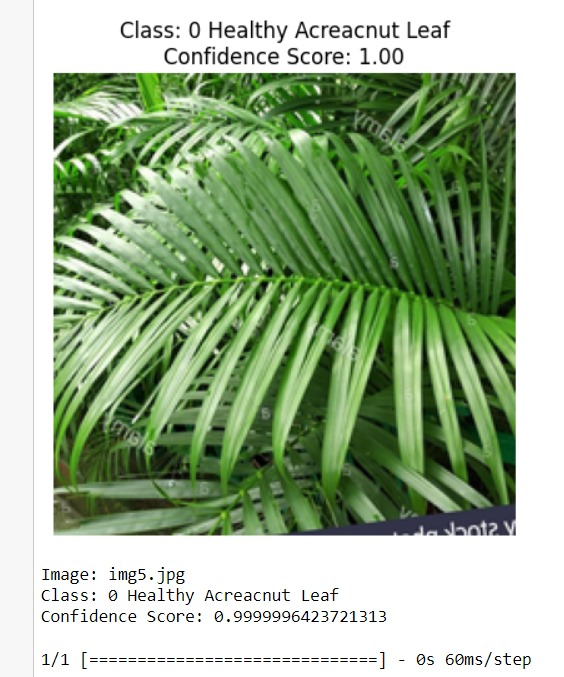
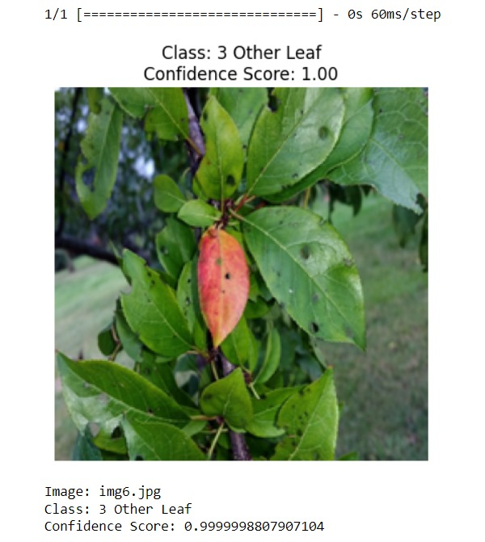
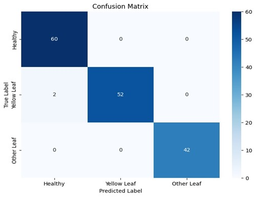
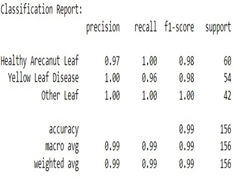

# Yellow Leaf Disease Detection and Autonomous Aerial Spraying Mechanism for Arecanut

This project presents an AI and IoT-based solution for detecting **Yellow Leaf Disease** in arecanut plantations and performing **targeted pesticide spraying** using a drone-mounted system. It leverages **ResNet-50** for classification and an **ESP32-CAM** module for real-time monitoring.

---

## 🚀 Features

- 🔍 Real-time disease detection using ResNet-50
- 🧠 Classifies leaves into Healthy, Yellow Leaf, Other, and No Leaf
- 🚁 Autonomous pesticide spraying via ESP32 and 12V pump
- 🧰 Drone-compatible, lightweight and modular hardware design
- 📈 Achieved 99.35% validation accuracy

---

## 🧠 Technologies Used

- Python, TensorFlow, Keras, OpenCV
- ESP32-CAM, 12V DC Pump, Relay
- CREO for CAD design
- 3D printing and laser-cut hardware
- Drone platform for deployment

---

## 📁 Project Structure

```
code/           → Jupyter notebook and model code
models/         → Trained ResNet50 model
hardware/       → Circuit diagrams, CAD models, drone images
video/          → Drone demonstration video
docs/           → Final report
```

---

## 📦 Installation

Install the required libraries:
```bash
pip install -r requirements.txt
```

---

## 🛠️ How It Works

1. **Image Capture** – Drone captures leaf images via ESP32-CAM.
2. **Classification** – ResNet-50 model detects diseased leaves.
3. **Trigger Relay** – Activates 12V pump to spray pesticide.
4. **Precision Spraying** – Sprays for exactly 5 seconds.
5. **Repeat** – Continues as the drone flies across the plantation.

---

## 🧪 Model Results

### ✅ Sample Predictions

- **Healthy Arecanut Leaf**



- **Arecanut Yellow Leaf Disease**


- **Other Leaf**


---

### 📊 Confusion Matrix



---

### 📋 Classification Report



---

### 🔁 Training Workflow


---

## 📷 Demo

🎥 [Watch Drone in Action](video/drone_demo.mp4)

---

## 📄 Report

See detailed methodology, hardware components, testing results, and modeling in the [Final Project Report](docs/project_report.pdf).

---

## 📘 IEEE Publication

📰 This project is **officially published in IEEE**.  
📖 Read it here: [IEEE Xplore - Yellow Leaf Disease Detection and Autonomous Aerial Spraying](https://ieeexplore.ieee.org/document/10895610)

---

## 🔒 License

This project is licensed under the [MIT License](LICENSE).

---

## 👩‍🔬 Authors

- Veeresha R.K.
- Shilpa M.K.
- Lathish Kumar N D
- Swaroop
- Samarth S Shetty
- Shrajan G Prasad

📢 Presented at **IEEE ICRASET 2024**  
📄 Patent application submitted.
